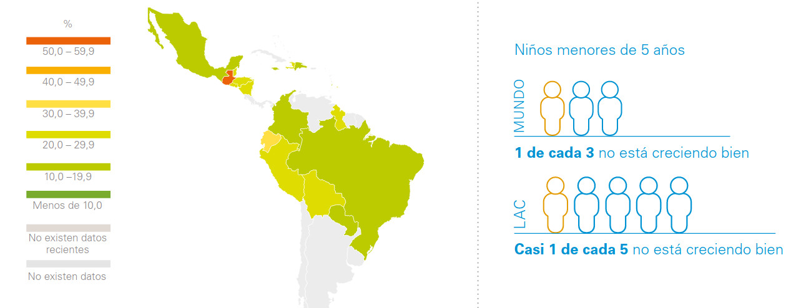
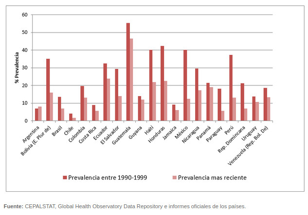
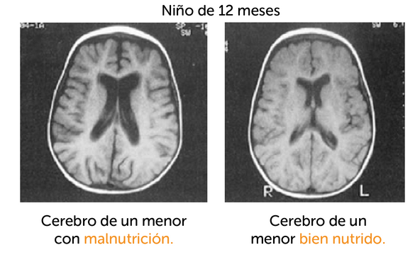
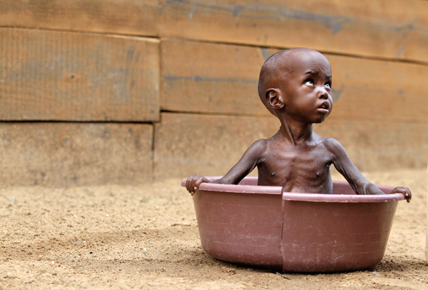
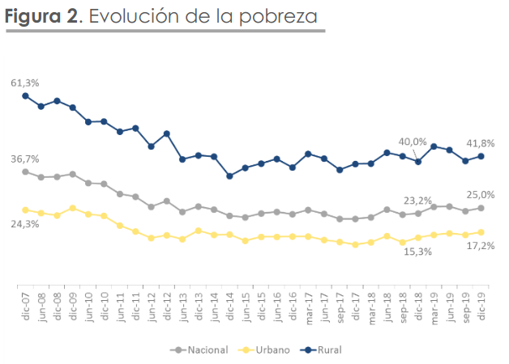
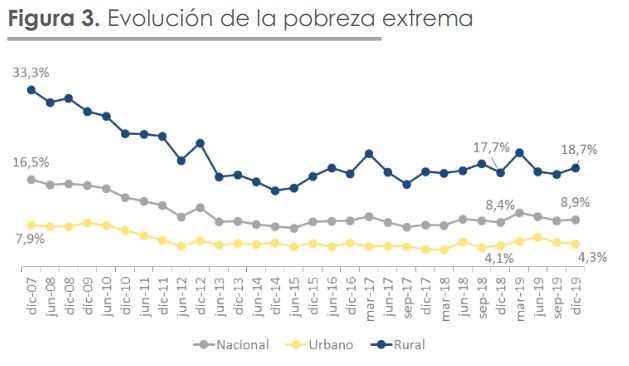
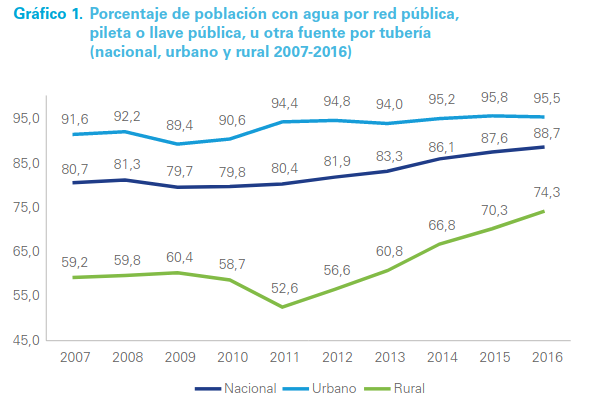
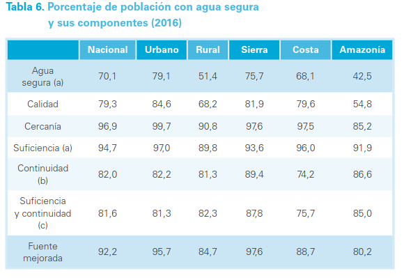
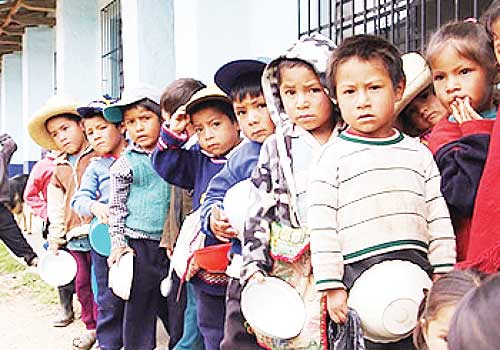

```{r setup, include=FALSE}
library(flexdashboard)
library(tidyverse)
library(readstata13)
library(kableExtra)
library(sf)
library(ggrepel)
library(knitr)

```

```{r include=FALSE}
persona <- read.dta13("./bases/1_BDD_ENS2018_f1_personas.dta") %>% as.tibble()
ninez <- read.dta13("./bases/6_BDD_ENS2018_f2_salud_ninez.dta") %>% as.tibble()
provincias <- st_read("./bases/provincias.geojson")
dpa <- read_csv("./bases/dpa.csv")
```


```{r funciones de Natsumi, echo=FALSE, include=FALSE}
formato_cantidad <- function(numero, dec = 0){format(round(numero, digits = dec), nsmall = dec, big.mark = ".", decimal.mark = ",")
}

fuente <- c("Fuente: INEC. \nEncuesta Nacional de Salud y Nutrición 2018")
```

```{r include=FALSE}

dpa_prov <- distinct(dpa, cod_prov, nombre_prov)
dpa_prov <- dpa_prov %>% 
  mutate(dpa_prov = as.factor(cod_prov),
         dpa_prov = case_when(dpa_prov== "1" ~ "01",
                              dpa_prov== "2" ~ "02",
                              dpa_prov== "3" ~ "03",
                              dpa_prov== "4" ~ "04",
                              dpa_prov== "5" ~ "05",
                              dpa_prov== "6" ~ "06",
                              dpa_prov== "7" ~ "07",
                              dpa_prov== "8" ~ "08",
                              dpa_prov== "9" ~ "09",
                              dpa_prov== "10" ~ "10",
                              dpa_prov== "11" ~ "11",
                              dpa_prov== "12" ~ "12",
                              dpa_prov== "13" ~ "13",
                              dpa_prov== "14" ~ "14",
                              dpa_prov== "15" ~ "15",
                              dpa_prov== "16" ~ "16",
                              dpa_prov== "17" ~ "17",
                              dpa_prov== "18" ~ "18",
                              dpa_prov== "19" ~ "19",
                              dpa_prov== "20" ~ "20",
                              dpa_prov== "21" ~ "21",
                              dpa_prov== "22" ~ "22",
                              dpa_prov== "23" ~ "23",
                              dpa_prov== "24" ~ "24",
                              TRUE ~ "90"))
personas <- persona %>% 
  mutate(cod_prov = as.numeric(prov))
personas <- left_join(personas, dpa_prov)
ninez <- ninez %>% 
    select(id_per, f2_s4f_451a_1, f2_s4f_451a1_1, f2_s4f_451num_1, f2_s4f_450_, f2_s4f_451b_1, f2_s4h_473_, f2_s4g_457_)
personas <- left_join(personas, ninez, by= "id_per")
personas <- personas %>% 
  mutate(dpa_prov = as.factor(cod_prov),
         dpa_prov = case_when(dpa_prov== "1" ~ "01",
                              dpa_prov== "2" ~ "02",
                              dpa_prov== "3" ~ "03",
                              dpa_prov== "4" ~ "04",
                              dpa_prov== "5" ~ "05",
                              dpa_prov== "6" ~ "06",
                              dpa_prov== "7" ~ "07",
                              dpa_prov== "8" ~ "08",
                              dpa_prov== "9" ~ "09",
                              dpa_prov== "10" ~ "10",
                              dpa_prov== "11" ~ "11",
                              dpa_prov== "12" ~ "12",
                              dpa_prov== "13" ~ "13",
                              dpa_prov== "14" ~ "14",
                              dpa_prov== "15" ~ "15",
                              dpa_prov== "16" ~ "16",
                              dpa_prov== "17" ~ "17",
                              dpa_prov== "18" ~ "18",
                              dpa_prov== "19" ~ "19",
                              dpa_prov== "20" ~ "20",
                              dpa_prov== "21" ~ "21",
                              dpa_prov== "22" ~ "22",
                              dpa_prov== "23" ~ "23",
                              dpa_prov== "24" ~ "24",
                              TRUE ~ "90"),
         pobrezaNA = case_when(pobreza =="0" ~ 0,
                               pobreza =="1" ~ 1,
                               TRUE ~ 99),
         epobrezaNA = case_when(epobreza =="0" ~ 0,
                               pobreza =="1" ~ 1,
                               TRUE ~ 99),
         f2_s4f_451a_1_na =case_when(f2_s4f_451a_1 == 0 ~ 0,
                                     f2_s4f_451a_1 == 1 ~ 1,
                                     f2_s4f_451a_1 == 2 ~ 2,
                                     f2_s4f_451a_1 == 3 ~ 3,
                                     f2_s4f_451a_1 == 4 ~ 4,
                                     f2_s4f_451a_1 == 5 ~ 5,
                                     f2_s4f_451a_1 == 6 ~ 6,
                                     f2_s4f_451a_1 == 7 ~ 7,
                                     f2_s4f_451a_1 == 8 ~ 8,
                                     f2_s4f_451a_1 == 9 ~ 9,
                                     f2_s4f_451a_1 == 10 ~ 10,
                                     f2_s4f_451a_1 == 11 ~ 11,
                                     f2_s4f_451a_1 == 12 ~ 12,
                                     f2_s4f_451a_1 == 13 ~ 13,
                                     f2_s4f_451a_1 == 14 ~ 14,
                                     f2_s4f_451a_1 == 15 ~ 15,
                                     f2_s4f_451a_1 == 16 ~ 16,
                                     f2_s4f_451a_1 == 17 ~ 17,
                                     f2_s4f_451a_1 == 18 ~ 18,
                                     f2_s4f_451a_1 == 19 ~ 19,
                                     f2_s4f_451a_1 == 20 ~ 20,
                                     f2_s4f_451a_1 == 21 ~ 21,
                                     f2_s4f_451a_1 == 24 ~ 24,
                                     f2_s4f_451a_1 == 30 ~ 30,
                                     f2_s4f_451a_1 == 36 ~ 36,
                                     f2_s4f_451a_1 == 77 ~ 77,
                                     f2_s4f_451a_1 == 88 ~ 88,
                                     TRUE~ 99),
         f2_s4f_451num_na =case_when(f2_s4f_451num_1 == 0 ~ 0,
                                     f2_s4f_451num_1 == 1 ~ 1,
                                     f2_s4f_451num_1 == 2 ~ 2,
                                     f2_s4f_451num_1 == 3 ~ 3,
                                     f2_s4f_451num_1 == 4 ~ 4,
                                     f2_s4f_451num_1 == 5 ~ 5,
                                     f2_s4f_451num_1 == 6 ~ 6,
                                     f2_s4f_451num_1 == 7 ~ 7,
                                     f2_s4f_451num_1 == 8 ~ 8,
                                     f2_s4f_451num_1 == 9 ~ 9,
                                     f2_s4f_451num_1 == 10 ~ 10,
                                     f2_s4f_451num_1 == 11 ~ 11,
                                     f2_s4f_451num_1 == 12 ~ 12,
                                     f2_s4f_451num_1 == 13 ~ 13,
                                     f2_s4f_451num_1 == 14 ~ 14,
                                     f2_s4f_451num_1 == 15 ~ 15,
                                     f2_s4f_451num_1 == 16 ~ 16,
                                     f2_s4f_451num_1 == 17 ~ 17,
                                     f2_s4f_451num_1 == 18 ~ 18,
                                     f2_s4f_451num_1 == 19 ~ 19,
                                     f2_s4f_451num_1 == 20 ~ 20,
                                     f2_s4f_451num_1 == 21 ~ 21,
                                     f2_s4f_451num_1 == 22 ~ 22,
                                     f2_s4f_451num_1 == 23 ~ 23,
                                     f2_s4f_451num_1 == 24 ~ 24,
                                     TRUE~ 99),
         motivo_consulta = case_when(f2_s4f_450_ == "¿estaba enfermo?" ~ 0,
                                     f2_s4f_450_ == "¿para control niño sano?" ~ 1,
                                     TRUE ~ 99),
         controles2a = case_when(f2_s4f_451b_1 == 0 ~ 0,
                                 f2_s4f_451b_1 == 1 ~ 1,
                                 f2_s4f_451b_1 == 2 ~ 2,
                                 f2_s4f_451b_1 == 3 ~ 3,
                                 f2_s4f_451b_1 == 4 ~ 4,
                                 f2_s4f_451b_1 == 5 ~ 5,
                                 f2_s4f_451b_1 == 6 ~ 6,
                                 f2_s4f_451b_1 == 7 ~ 7,
                                 f2_s4f_451b_1 == 8 ~ 8,
                                 f2_s4f_451b_1 == 9 ~ 9,
                                 f2_s4f_451b_1 == 10 ~ 10,
                                 f2_s4f_451b_1 == 11 ~ 11,
                                 f2_s4f_451b_1 == 12 ~ 12,
                                 f2_s4f_451b_1 == 13 ~ 13,
                                 f2_s4f_451b_1 == 14 ~ 14,
                                 f2_s4f_451b_1 == 15 ~ 15,
                                 f2_s4f_451b_1 == 16 ~ 16,
                                 f2_s4f_451b_1 == 17 ~ 17,
                                 f2_s4f_451b_1 == 18 ~ 18,
                                 f2_s4f_451b_1 == 19 ~ 19,
                                 f2_s4f_451b_1 == 20 ~ 20,
                                 f2_s4f_451b_1 == 21 ~ 21,
                                 f2_s4f_451b_1 == 23 ~ 23,
                                 f2_s4f_451b_1 == 24 ~ 24,
                                 f2_s4f_451b_1 == 30 ~ 30,
                                 f2_s4f_451b_1 == 32 ~ 32,
                                 f2_s4f_451b_1 == 77 ~ 77,
                                 f2_s4f_451b_1 == 88 ~ 88,
                                 TRUE~ 99),
         etnia_f = as.factor(etnia),
         etnia_f = case_when(etnia== 1 ~ "Indigena",
                              etnia== 2 ~ "Afroecutoriano",
                              etnia== 3 ~ "Mestizo",
                              etnia== 4 ~ "Blanco",
                              etnia== 5 ~ "Montubios y otros")) %>% 
  select(cod_prov, edadanios, edadmeses, f2_s4f_451a_1, f2_s4f_451a_1_na, f2_s4f_451a1_1, f2_s4f_451num_1, f2_s4f_451num_na, f2_s4f_450_, f2_s4f_451b_1, pobreza, pobrezaNA, epobreza, epobrezaNA, nbi_1, nbi_2, etnia, etnia_f, quintil, area, prov, dpa_prov, controles2a, motivo_consulta, sexo, nombre_prov, fexp, dcronica, dcronica_2, f1_s4_41, f1_s4_47, f2_s4h_473_, f2_s4g_457_, f2_s4g_457_)

provincias <- provincias %>%
  mutate(centroid = map(geometry, st_centroid), 
         coords = map(centroid, st_coordinates), 
         coords_x = map_dbl(coords, 1), 
         coords_y = map_dbl(coords, 2))

```
Datos Generales
========================================================================
Column
------------------------------------------------------------------------
### Contexto general 

```{r}
dc_menor5 <- personas %>%
  filter(edadmeses <= 60 & dcronica !="NA") %>% 
  summarise(Poblacion     = sum(fexp),
            desnutricion5 = sum(fexp[dcronica == "1"]),
            'Población menor de 5 años'    = formato_cantidad(Poblacion),
            'Desnutrición Total menores de 5 años' = formato_cantidad(desnutricion5, 0),
            'Tasa Desnutrición menores de 5 años' = round(desnutricion5/Poblacion *100, 2)) %>% 
  select(-c(1:2)) %>% 
  gather(Indicadores, Valor, 1:3)

Año <- c(2012, 2018)
Datos <- c(25.3, as.numeric(dc_menor5[3,2]))
g_dc_5 <- tibble(Año, Datos)
text1 <- c("ECV\n2014")
text2 <- c("Meta PND\n2021")
ggplot(g_dc_5, aes(Año, Datos))+
  geom_bar(stat = "identity", fill = c("lightblue", "lightyellow"))+
  geom_text(aes(label=Datos), position= position_dodge(width=5), vjust=-0.50, show.legend = "none")+
  geom_segment(aes(x=2009, xend=2015, y=23.9, yend=23.9), color = "lightpink")+
  geom_segment(aes(x=2015, xend=2021, y=13.2, yend=13.2), color = "red")+
  ylim(0, 30)+
  scale_x_continuous(breaks = c(2012, 2018))+
  labs(
    title = "ECUADOR. Desnutrición Crónica menores de 5 años",
    subtitle = "Años 2012 y 2018",
    caption = "Elaboración propia\nFuente: INEC. Ensanut 2018 y 2012",
    x="Períodos",
    y="Prevalencia de Desnutrición (%)"
  )+
  geom_label(aes(x=2009, y= 23.9, label=text1), label.size= NA, size=2.5, color="red")+
  geom_label(aes(x=2021.5, y= 13.2, label=text2), label.size= NA, size=2.5, color="red")

```

Column{.tabset}
-----------------------------------------------------------------------
### UNICEF

```{r}

```

### CEPAL

```{r}


```

Desagregados {data-icon="fa-list"}
========================================================================
Column{data-width=350}
------------------------------------------------------------------------
### Total niños con Desnutrición

```{r sexo <5, include=FALSE, echo = FALSE}
sexo_menor5 <- personas %>%
  filter(edadmeses <= 60 & dcronica !="NA" & sexo !="NA") %>% 
  group_by(sexo) %>% 
  summarise(Poblacion     = sum(fexp),
            desnutricion5 = sum(fexp[dcronica == "1"]),
            'Población menor de 5 años'    = formato_cantidad(Poblacion),
            'Desnutrición Total menores de 5 años' = formato_cantidad(desnutricion5, 0),
            'Tasa por Sexo' = round(desnutricion5/Poblacion *100, 2)) %>%   
  select(-c(2:5)) %>% 
  gather(Indicadores, Valor, 2)

Añosexo <- c(rep(2012, 2), rep(2018,2))
Sexo <- c("Niño", "Niña", "Niño", "Niña") 
DatosSexo <- as.numeric(c(25.8, 24.6, sexo_menor5[1,3], sexo_menor5[2,3]))

g_sexo_dc_5 <- tibble(Añosexo, Sexo, DatosSexo)

```

```{r}
desnutrición_ninos <- g_sexo_dc_5 %>% filter(Sexo =="Niño" & Añosexo == 2018) %>% select(DatosSexo)
valueBox(value = paste0(desnutrición_ninos, "%"), icon = "fas fa-child", caption = "Niños",color = "lightblue")
```

### Total niñas con Desnutrición

```{r}
desnutrición_ninos <- g_sexo_dc_5 %>% filter(Sexo =="Niña" & Añosexo == 2018) %>% select(DatosSexo)
valueBox(value = paste0(desnutrición_ninos, "%"), icon = "fas fa-child", caption = "Niñas",color = "pink")
```


### Desnutrición por Area:


```{r area <5, include=FALSE, echo = FALSE}
area_menor5 <- personas %>%
  filter(edadmeses <= 60 & dcronica !="NA" & area !="NA") %>% 
  group_by(area) %>% 
  summarise(Poblacion     = sum(fexp),
            desnutricion5 = sum(fexp[dcronica == "1"]),
            'Población menor de 5 años'    = formato_cantidad(Poblacion),
            'Desnutrición Total menores de 5 años' = formato_cantidad(desnutricion5, 0),
            'Tasa por Área' = round(desnutricion5/Poblacion *100, 2)) %>%   
  select(-c(2:5)) %>% 
  gather(Indicadores, Valor, 2)
```


```{r}
desnutrición_area <- area_menor5 %>% filter(area =="urbano") %>% select(Valor)
valueBox(value = paste0(desnutrición_area, "%"), icon = "fas fa-building", caption = "Zona Urbana", color = "violet")
```

### Total Desnutrición Rural

```{r}
desnutrición_area <- area_menor5 %>% filter(area =="rural") %>% select(Valor)
valueBox(value = paste0(desnutrición_area, "%"), icon = "fas fa-tree", caption = "Zona Rural", color = "lightgreen")
```


Column{.tabset}
-----------------------------------------------------------------------------
### Desnutrición por autoidentificación étnica:

```{r etnia <5, include=FALSE, echo = FALSE}
etnia_menor5 <- personas %>%
  filter(edadmeses <= 60 & dcronica !="NA" & etnia_f !="NA") %>% 
  group_by(etnia_f) %>% 
  summarise(Poblacion     = sum(fexp),
            desnutricion5 = sum(fexp[dcronica == "1"]),
            'Población menor de 5 años'    = formato_cantidad(Poblacion),
            'Desnutrición Total menores de 5 años' = formato_cantidad(desnutricion5, 0),
            'Tasa por etnia' = round(desnutricion5/Poblacion *100, 2)) %>%   
  select(-c(2:5)) %>% 
  gather(Indicadores, Valor, 2)

```

```{r}
ggplot(etnia_menor5, aes(etnia_f, Valor, fill=etnia_f))+
  geom_bar(stat = "identity", position = "dodge", show.legend = FALSE)+
  geom_text(aes(label=Valor), size=3, position= position_dodge(width=1), vjust=-0.50, hjust=-0.5)+
  ylim(0,50)+
  coord_flip()+
  labs(
    title = "Desnutrición Crónica menores de 5 años \npor Autoidentificación Étnica",
    subtitle = "Año 2018",
    caption = "Elaboración propia\nFuente: INEC. Ensanut 2018",
    x="Autoidentificación",
    y="Prevalencia de Desnutrición (%)",
    legend= "Autoidentificación"
  )

```

### Distribución territorial por provincias:

```{r mapa1.1, echo=FALSE, message=FALSE, warning=FALSE, include=FALSE}
mapa1.1a <- personas %>% 
  filter(edadanios <= 5 & dcronica !="NA") %>%
  group_by(dpa_prov) %>% 
  summarise(Poblacion     = sum(fexp),
            desnutricion5 = sum(fexp[dcronica == 1]))

mapa1.1b <- left_join(provincias, mapa1.1a, by="dpa_prov")

```


```{r mapa1.1b, echo=FALSE, message=FALSE, warning=FALSE}
ggplot() + 
  geom_sf(data=mapa1.1b %>% filter(dpa_prov != "20" & desnutricion5!="NA"), aes(fill = desnutricion5/Poblacion * 100), color= NA)  +
    scale_fill_viridis_b()+
    labs(title = "Prevalencia de Desnutrición menores de 5 años por Provincias",
         subtitle = "Ecuador - ENSANUT 2018-2019",
         fill = "Tasa Desnutrición",
         caption = "Elaboración propia\nFuente: INEC")+
  geom_text_repel(provincias %>% filter(dpa_prov != "20"), mapping = aes(coords_x, coords_y, label = dpa_despro), size = 1.5, min.segment.length = 0.3, color="red")+
    labs(x = "", y = "")
```


Pobreza
========================================================================
Column
------------------------------------------------------------------------

### Desnutrición por Quintiles:

```{r quintiles <5, include=FALSE, echo = FALSE}
quintil_menor5 <- personas %>%
  filter(edadmeses <= 60 & dcronica !="NA" & quintil !="NA") %>% 
  group_by(quintil) %>% 
  summarise(Poblacion     = sum(fexp),
            desnutricion5 = sum(fexp[dcronica == "1"]),
            'Población menor de 5 años'    = formato_cantidad(Poblacion),
            'Desnutrición Total menores de 5 años' = formato_cantidad(desnutricion5, 0),
            'Tasa por Quintiles' = round(desnutricion5/Poblacion *100, 2)) %>%   
  select(-c(2:5)) %>% 
  gather(Indicadores, Valor, 2)
```

```{r}

AñoQuintil <- c(rep(2012, 5), rep(2018,5))
Quintil <- c("Quintil 1", "Quintil 2", "Quintil 3", "Quintil 4", "Quintil 5", "Quintil 1", "Quintil 2", "Quintil 3", "Quintil 4", "Quintil 5") 
DatosQuintil <- as.numeric(c(36.5, 28.5, 20.0, 18.1, 13.8, quintil_menor5[1,3], quintil_menor5[2,3], quintil_menor5[3,3], quintil_menor5[4,3], quintil_menor5[5,3]))

g_quintil_dc_5 <- tibble(AñoQuintil, Quintil, DatosQuintil)


ggplot(g_quintil_dc_5, aes(AñoQuintil, DatosQuintil, fill=Quintil))+
  geom_bar(stat = "identity", position = "dodge")+
  geom_text(aes(label=DatosQuintil), size=3, position= position_dodge(width=6), vjust=-0.50, show.legend = FALSE) +
  ylim(0, 40)+
  scale_x_continuous(breaks = c(2012, 2018))+
  labs(
    title = "Desnutrición Crónica menores \nde 5 años por Quintiles por Ingresos ",
    subtitle = "Años: 2012 y 2018",
    caption = "Elaboración propia\nFuente: INEC. Ensanut 2012 y Ensanut 2018",
    x="Períodos",
    y="Prevalencia de Desnutrición (%)"
  )
```

Column
-----------------------------------------------------------------------
### Desnutrición y Pobreza:

```{r desnutricion cronica <5 pobreza, include=FALSE, echo = FALSE}
dc_menor5NBI_ingreso <- personas %>%
  filter(edadanios <= 5 & dcronica !="NA") %>% 
  summarise(Poblacion     = sum(fexp),
            PobreNBI      = sum(fexp[nbi_1 ==1]),
            PobreNBIE     = sum(fexp[nbi_2 ==1]),
            PobreIngre    = sum(fexp[pobrezaNA ==1]),
            PobreExIng    = sum(fexp[epobrezaNA ==1]),
            desnutricion5 = sum(fexp[dcronica == 1]),
            desNBI1       = sum(fexp[dcronica == 1 & nbi_1==1]),
            desNBI2       = sum(fexp[dcronica == 1 & nbi_2==1]),
            desINGRESO    =sum(fexp[dcronica == 1 & pobrezaNA==1]),
            desEXINGRE    =sum(fexp[dcronica == 1 & epobrezaNA==1]),
            'Población menor de 5 años'    = formato_cantidad(Poblacion),
            'Desnutrición Total menores de 5 años' = formato_cantidad(desnutricion5, 0), 
            'Desnutrición < de 5 años' = round(desnutricion5/Poblacion *100, 2),
            'Pobres por NBI' = round(desNBI1/PobreNBI *100, 2),
            'Pobres Extremos por NBI' = round(desNBI2/PobreNBIE *100, 2),
            'Pobres por Ingresos'   = round(desINGRESO/PobreIngre *100,2),
            'Pobres Extremos por Ingresos' = round(desEXINGRE/PobreExIng *100,2)) %>% 
  select(-c(1:12)) %>% 
  gather(Indicadores, Valor, 1:5)


```

```{r}
ggplot(dc_menor5NBI_ingreso, aes(Indicadores, Valor, fill=Indicadores))+
  geom_bar(stat = "identity", position = "dodge", show.legend = FALSE)+
  theme(axis.text.x = element_text(angle = 90, vjust = 0, hjust = 0)) +
  geom_text(aes(label=Valor), size=3, position= position_dodge(width=1), vjust=0.3, hjust=-0.5)+
  ylim(0,50)+
  coord_flip()+
  labs(
    title = "Desnutrición Crónica en menores de 5 años\ny condiciones de pobreza (NBI e Ingresos)",
    subtitle = "Año 2018",
    caption = "Elaboración propia\nFuente: INEC. Ensanut 2018",
    x="Condición",
    y="Prevalencia de Desnutrición (%)"
  )
```

Salud
========================================================================
Column
------------------------------------------------------------------------

### Desnutrición y atenciones en salud:

```{r chequeados, include=FALSE, echo=FALSE}

#Población contados, NN desnutridos y NN Chequeados ultimo mes
Tabla_chequeados <- personas %>% 
  filter(edadanios<5 & dcronica !=99) %>% 
  summarise(PoblacionCalculo =sum(fexp),
            DesnutriciónCrónica =sum(fexp[dcronica == 1]),
            Chequeados = sum(fexp[f1_s4_41 == "si" & dcronica ==1]),
            'Población de NN considerados para cálculos' =formato_cantidad(PoblacionCalculo),
            'Población de NN con Desnutrición Crónica' =formato_cantidad(DesnutriciónCrónica, 0),
            'Población de NN con Desnutrición Chequeados el último mes' =formato_cantidad(Chequeados, 0),
            'Tasa Desnutrición Crónica (%)'    = round(DesnutriciónCrónica/PoblacionCalculo *100, 2),
            'Tasa de NN con Desnutrición Chequeados último mes (%)'= round(Chequeados/DesnutriciónCrónica *100, 2) ) %>% 
  select(-c(1:4)) %>% 
  gather(Indicadores, Valor, 1:4)

```


__Cuadro 1.2. Ecuador.__ Población menor a 5 años con Desnutrición crónica que fue chequeada el mes anterior por un médico
```{r tabla_1_3, echo=FALSE, message=FALSE, warning=FALSE}
kable(Tabla_chequeados, align = "r") %>% 
  kable_styling(bootstrap_options = c("striped", "hover"), full_width = F, position = "center") %>% 
  add_footnote(c("Fuente: INEC. \nEncuesta Nacional de Salud y Nutrición 2018"), notation = "symbol")
```
  

Reflexión final{.storyboard}
========================================================================  

### Los primeros años de vida. {data-commentary-width=600}

{width=50%} {width=50%} 


***
__Nutrición adecuada y desarrollo cognitivo:__
La nutrición es uno de los pilares de la salud y el desarrollo. La mejora de la nutrición pasa por promover la salud los lactantes y los niños pequeños.

__Los niños sanos aprenden mejor__. La gente sana es más fuerte, más productiva y está en mejores condiciones de romper el ciclo de pobreza y hambre y de desarrollar al máximo su potencial. __En Ecuador, la próxima generación tiene 1 de cada 4 personas en desventaja seminal__

__La malnutrición, en cualquiera de sus formas__, acarrea riesgos considerables para la salud humana. En la actualidad, el mundo se enfrenta a una doble carga de malnutrición que incluye tanto la desnutrición como la alimentación excesiva y el sobrepeso, sobre todo en los países de ingresos medianos y bajos.

__Cuidado cariñoso:__
"Cuidado cariñoso y sensible: Se refere a un entorno estable creado por los padres y otros cuidadores que asegura la salud y nutrición adecuadas de los niños, los protege de los riesgos y brinda oportunidades a los niños pequeños para el aprendizaje temprano, mediante interacciones que son emocionalmente propicias y receptvas." (OMS) 

__¿Es posible un cuidado cariñoso en estas condiciones?__

### Reconocimiento de una problemática {data-commentary-width=400}

```{r fig.cap= "tomado de: http://noticias.masverdedigital.com/africa-subsahariana-mas-de-7-millones-de-ninos-murieron-en-2010/", out.width=33, fig.show="hold"}

```


***
A pesar de ser la niñez un grupo de atención prioritaria, según establece en el Capítulo Tercero, Artículo 35 de la Constitución de la República del Ecuador y del reconocimiento de la problemática por el Ejecutivo Nacional, no logra la sociedad ecuatoriana superar la problemática de la desnutrición que, de alguna manera, marca la continuación de la desigualdad y profundización de la pobreza para las próximas décadas.

Según los datos regionales existentes a la fecha, sólo Guatemala supera una prevalencia tan elevada, seguida por Ecuador y luego Honduras. Los vecinos del país, __Colombia y Perú, muestran tasas que rondan el 13% de desnutrición__, es decir, cerca de 10 puntos menos que Ecuador.


### La pobreza y desigualdad perpetúan las condiciones estructurales de la Desnutrición.

{width=47%} {width=47%} 


***
La pobreza contribuye con el deteriodo de las condiciones de salud, en particular, la Desnutrición. Los datos evidencia que, a mayor pobreza, mayor es la prevalencia de la desnutrición crónica 

***
Gráficos tomados de Instituto Nacional de Estadística y Censos - INEC. Fuente Enemdu

### Acceso a Agua Potable y prácticas culturales saludables y Desnutrición  {data-commentary-width=100}
{width=30%}
{width=60%}  

***
Tomado del INEC


### El sistema de Salud y la atención para prevenir la desnutrición


```{r fig.cap= "tomado de: https://diariouno.pe/peru-y-ecuador-acuerdan-lucha-contra-desnutricion-infantil/", out.width=33, fig.show="hold"}

  
```

***
Una referencia a las tarjetas de salud, a las visitas al médico a NN con DC

